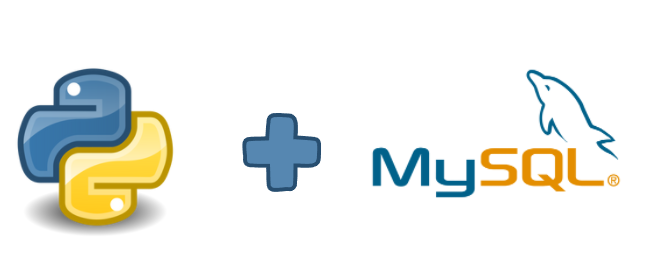

## CRUD desenvolvido para a cadeira de introdução a armazenamento e análise de dados
### Criado utilizando Python + MySql

<p align="center">
  
</p>

Uma solução interessante para o projeto proposto pela cadeira. Criado utilizando duas librarys python: tkinter e pymysql.

#Configuração do ambiente

Para utilizar o pymysql é necessário ter o pip, que é um sistema de gerenciamento de pacotes usado para instalar e gerenciar pacotes no Python. 
As instruções abaixo mostram como fazer a instalação:

1.Baixe o arquivo get-pip.py para uma pasta do seu computador.

2. Abra um terminal na pasta onde está o arquivo e execute o seguinte comando: 
```
python get-pip.py
```
3. Caso você queira consultar a versão, basta digitar:
```
pip --version
```
Com o pip pronto, é só seguir para a instalação da biblioteca pymysql. Para isto, use:
```
pip install pymysql
```
#Utilização das bibliotecas

Para utilizar as bibliotecas, fizemos o import como mostrado a seguir:
```
from tkinter import *
from tkinter import ttk
import tkinter.messagebox
import pymysql
```


#Especificações do projeto:
Linguagem: Python
Versão: 3.8
Bibliotecas: Tkinter e pymysql
SGBD: MySQL
Ferramenta visual do SGBD: Workbench
